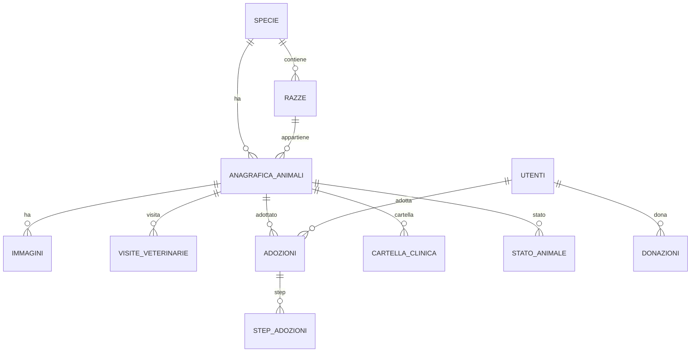

# 📌 Diamoci una zampa - rifugio per animali
---
Questo progetto è puramente a scopo didattico, consiste nella creazione di un applicazione web di un rifugio per animali, fondato e gestito dal sig. Leonardo Ippolito Zampa.

---

## 📝 Descrizione

Attraverso questo programma, sarà presente un interfaccia utente, che permetta di conoscere la storia e l'obiettivo del rifugio,  
i componenti, e navigare all'interno del sito per visualizzare gli animali presenti nel rifugio. 
Ogni animale avrà una sua sezione personale, con tutti i dettagli necessari(nome, razza,età, sesso, cartella clinica),
una descrizione della loro personalità, e l'opportunità di poter adottare l'animale.
Inoltre sarà presente una dashboard per l'admin, che permetterà a quest'ultimo di gestire:
- Anagrafica degli animali;
- Adozioni;
- Donazioni;
- Visite veterinarie.

---

### Stack tecnologico:

- Backend: Java + Spring Boot  
- Frontend: HTML, CSS, Javascript 
- Database: H2 + MySQL

---

## 📁 Struttura del Progetto

```plaintext
/backend     → API e logica server  
/frontend    → UI dell’applicazione  
/database    → Script SQL e migrazioni  
/docs        → Documentazione tecnica  
/assets      → Immagini e risorse statiche  
```
---

## 🛠️ Tecnologie Utilizzate
```plaintext
Backend: Java 17 + Spring Boot
Frontend: HTML, CSS, Javascript
Database: H2
Utility: Git + GitHub
```
---

## 👨‍💻 Team - Kedis


Marco Dima – Team leader - Software dev student – [MarcoDima02](https://github.com/MarcoDima02)

Dario Ilescu – Software dev student – [ilda-05](https://github.com/ilda-05)

Marco Spedialiere – Software dev student – [MarcoSpeda](https://github.com/MarcoSpeda)

Luca Di Pasquale – Software dev student – [LucaDipa11](https://github.com/LucaDipa11)

Lorenzo Maero – Software dev student – [LorenzoMaero](https://github.com/LorenzoMaero)

---

## 📌 Stato del Progetto

Completato
------------------------------------------------------------------------------------------------------


# Documentazione del progetto: Metodi, Funzioni e Approcci

---

## Indice
1. [Struttura del Database](#struttura-del-database)
2. [Panoramica Architetturale](#panoramica-architetturale)
3. [Controller](#controller)
4. [Service Layer](#service-layer)
5. [Repository Layer](#repository-layer)
6. [Entity (Entità)](#entity-entità)
7. [DTO e Utility](#dto-e-utility)
8. [Frontend (Thymeleaf, CSS, JS)](#frontend-thymeleaf-css-js)
9. [Database e Data.sql](#database-e-data-sql)
10. [Gestione Immagini](#gestione-immagini)
11. [Flussi Completi](#flussi-completi)
12. [Validazione, Sicurezza, Performance](#validazione-sicurezza-performance)
13. [Testabilità e Logging](#testabilità-e-logging)
14. [Estendibilità e Considerazioni Future](#estendibilità-e-considerazioni-future)


## Struttura del Database

### Motivazione Progettuale
La struttura del database è pensata per garantire integrità referenziale, flessibilità nella gestione di animali, utenti, adozioni, donazioni, visite veterinarie e immagini. Ogni tabella riflette una specifica entità o relazione del dominio, con chiavi esterne per collegare i dati in modo consistente.

### Elenco Tabelle Principali
- **stato_animale**: Stati possibili per un animale (Disponibile, Adottato, In cura, ecc.)
- **specie**: Tipologie di animali (Cane, Gatto, ...)
- **razze**: Razze specifiche, collegate a specie
- **cartella_clinica**: Dati sanitari dell'animale
- **anagrafica_animali**: Dati anagrafici e relazioni dell'animale
- **utenti**: Persone registrate, con soft delete (`attivo`)
- **step_adozioni**: Fasi del processo di adozione
- **donazioni**: Tracciamento delle donazioni
- **adozioni**: Relazione tra animale e utente, con step e note
- **visite_veterinarie**: Storico visite e motivi
- **immagini**: Foto associate agli animali, con flag principale e ordinamento

### Relazioni e Chiavi Esterne
- Le razze sono collegate alle specie
- Gli animali sono collegati a specie, razza, cartella clinica, stato
- Le adozioni collegano animali e utenti, con step
- Le donazioni sono collegate agli utenti
- Le visite veterinarie sono collegate agli animali
- Le immagini sono collegate agli animali

### Rappresentazione Grafica (Diagramma Testuale)


#### Legenda e Spiegazione del Diagramma
- **||--o{** indica una relazione uno-a-molti (1:N)
- **SPECIE → RAZZE**: Una specie può avere molte razze
- **SPECIE → ANAGRAFICA_ANIMALI**: Una specie può avere molti animali
- **RAZZE → ANAGRAFICA_ANIMALI**: Una razza può essere associata a molti animali
- **ANAGRAFICA_ANIMALI → IMMAGINI**: Un animale può avere molte immagini
- **ANAGRAFICA_ANIMALI → VISITE_VETERINARIE**: Un animale può avere molte visite
- **ANAGRAFICA_ANIMALI → ADOZIONI**: Un animale può essere adottato più volte (storico)
- **ANAGRAFICA_ANIMALI → CARTELLA_CLINICA**: Un animale ha una cartella clinica
- **ANAGRAFICA_ANIMALI → STATO_ANIMALE**: Un animale ha uno stato
- **UTENTI → DONAZIONI**: Un utente può fare molte donazioni
- **UTENTI → ADOZIONI**: Un utente può adottare più animali
- **ADOZIONI → STEP_ADOZIONI**: Ogni adozione ha uno step associato

Questa rappresentazione aiuta a visualizzare le relazioni tra le entità principali del database, facilitando la comprensione della struttura e delle dipendenze tra i dati.

### Esempio di Motivazione
- **Immagini**: Separate per gestire più foto per animale, ordinamento e immagine principale
- **Soft delete utenti**: Permette di mantenere lo storico delle operazioni
- **Step adozioni**: Traccia il percorso di adozione per ogni animale
- **Cartella clinica**: Centralizza i dati sanitari, semplifica aggiornamenti

### Considerazioni
- Tutte le relazioni sono pensate per evitare dati orfani e garantire coerenza
- Le chiavi esterne prevengono errori di integrità
- La struttura è facilmente estendibile per nuove funzionalità (es. log, audit, notifiche)

---

---

## Panoramica Architetturale

Il progetto KedisRifugio segue una struttura multilayer:

Scelte architetturali:

## Gestione Immagini

### Motivazione
La gestione delle immagini permette di associare foto agli animali, migliorando la presentazione e l'esperienza utente. È fondamentale per la trasparenza e l'attrattività delle schede animali.

### Architettura

### Metodi Chiave

#### Esempio: `ImmagineServiceImpl#uploadImmagine()`
```java
public Immagini uploadImmagine(MultipartFile file, Integer idAnimale) {
    // Validazione formato e dimensione
    if (!file.getContentType().startsWith("image/")) throw new IllegalArgumentException("Formato non valido");
    if (file.getSize() > MAX_SIZE) throw new IllegalArgumentException("Immagine troppo grande");
    Immagini img = new Immagini();
    img.setNome(file.getOriginalFilename());
### Scenari Rilevanti

#### Soft Delete Animale e Immagini Associate
Quando un animale viene "soft deleted" (`attivo = false`), le immagini associate non vengono eliminate fisicamente dal database. Rimangono collegate per motivi storici e di audit, ma non sono più mostrate nel frontend. Il service filtra le immagini solo per animali attivi:
```java
public List<Immagini> getImmaginiAttiveByAnimale(Integer idAnimale) {
    Animale a = anagraficaAnimaliRepo.findById(idAnimale).orElseThrow();
    if (!a.isAttivo()) return Collections.emptyList();
    return immagineRepo.findByAnimaleIdOrderByOrdineVisualizzazioneAsc(idAnimale);
}
```
**Edge case:** Ripristino animale: le immagini tornano visibili.

#### Gestione Immagine Principale
Solo una immagine può essere "principale" per ogni animale. Il service imposta il flag e aggiorna le altre:
```java
public void setImmaginePrincipale(Integer idImmagine, Integer idAnimale) {
    List<Immagini> imgs = immagineRepo.findByAnimaleId(idAnimale);
    for (Immagini img : imgs) img.setPrincipale(img.getId().equals(idImmagine));
    immagineRepo.saveAll(imgs);
}
```
**Best practice:** Aggiornare in transazione, validare input.

#### Ordinamento Immagini
L'utente può riordinare le immagini tramite drag&drop. Il service aggiorna il campo `ordineVisualizzazione`:
```java
public void aggiornaOrdineImmagini(List<Integer> idsOrdinati) {
    int ordine = 0;
    for (Integer id : idsOrdinati) {
        Immagini img = immagineRepo.findById(id).orElseThrow();
        img.setOrdineVisualizzazione(ordine++);
        immagineRepo.save(img);
    }
}
```

#### Errori di Upload e Sicurezza
Se l'upload fallisce (formato errato, dimensione eccessiva, utente non autenticato), il controller mostra un messaggio chiaro e logga l'evento. Solo utenti autenticati possono caricare/eliminare immagini.

#### Pulizia Immagini Orfane
Script periodico elimina immagini non associate ad alcun animale (animale eliminato fisicamente):
```java
@Scheduled(cron = "0 0 3 * * *")
public void puliziaImmaginiOrfane() {
    List<Immagini> orfane = immagineRepo.findOrfane();
    immagineRepo.deleteAll(orfane);
}
```
**Best practice:** Loggare le eliminazioni, audit trail.

#### Audit Trail
Ogni upload/eliminazione viene tracciato con utente, timestamp e operazione per motivi di sicurezza e trasparenza.

#### Integrazione con Soft Delete Utente
Se un utente viene soft deleted, non può più caricare/eliminare immagini. Il controller verifica lo stato utente prima di consentire l'operazione.

#### Visualizzazione Ottimizzata
Le immagini vengono caricate in modo "lazy" e mostrate come thumbnail per migliorare le performance.

#### API REST per Mobile
Endpoint dedicati permettono di caricare e visualizzare immagini da app mobile, con autenticazione JWT.

    img.setDati(file.getBytes());
    img.setDataCaricamento(LocalDate.now());
    img.setAnimale(anagraficaAnimaliRepo.findById(idAnimale).orElseThrow());
    return immagineRepo.save(img);
}
```
- **Edge case:** File non immagine, dimensione eccessiva, animale non trovato
- **Best practice:** Validare sempre input, gestire errori, limitare dimensione

#### Esempio: `ImmagineServiceImpl#getImmaginiByAnimale()`
```java
public List<Immagini> getImmaginiByAnimale(Integer idAnimale) {
    return immagineRepo.findByAnimaleIdOrderByOrdineVisualizzazioneAsc(idAnimale);
}
```

#### Esempio: `ImmagineServiceImpl#deleteImmagine()`
```java
public void deleteImmagine(Integer idImmagine) {
    immagineRepo.deleteById(idImmagine);
}
```

### Flusso Tipico
1. Utente seleziona file e lo carica tramite form
2. Controller riceve il file, lo passa al service
3. Service valida, salva, associa l'immagine all'animale
4. Repository persiste l'immagine
5. Frontend mostra anteprima/galleria aggiornata

### Best Practice
- Limitare dimensione e formato immagini
- Consentire solo upload autenticati
- Gestire immagine principale e ordinamento
- Ottimizzare caricamento e visualizzazione (lazy loading, thumbnail)
- Documentare API e flussi

### Considerazioni Future
- Supporto a formati multipli (webp, png, jpeg)
- Ottimizzazione storage (cloud, CDN)
- Script di pulizia immagini orfane
- Audit trail per upload/eliminazione
- API REST per integrazione con app mobile

---

## Controller

### Motivazione
Gestiscono le richieste HTTP, validano i dati, orchestrano la logica di presentazione e comunicano con i service.

### Architettura
- Ogni controller è annotato con `@Controller` o `@RestController`
- Riceve dati dai form, li valida, li passa ai service
- Gestisce errori e feedback utente

### Metodi Chiave

#### Esempio: `DashboardAdminController#getDashboardAdmin()`
```java
@GetMapping("/dashboard/admin")
    model.addAttribute("numUtenti", utentiService.countAttivi());
## Struttura del Database

### Motivazione Progettuale
La struttura del database è pensata per garantire integrità referenziale, flessibilità nella gestione di animali, utenti, adozioni, donazioni, visite veterinarie e immagini. Ogni tabella riflette una specifica entità o relazione del dominio, con chiavi esterne per collegare i dati in modo consistente.

### Elenco Tabelle Principali
- **stato_animale**: Stati possibili per un animale (Disponibile, Adottato, In cura, ecc.)
- **specie**: Tipologie di animali (Cane, Gatto, ...)
- **razze**: Razze specifiche, collegate a specie
- **cartella_clinica**: Dati sanitari dell'animale
- **anagrafica_animali**: Dati anagrafici e relazioni dell'animale
- **utenti**: Persone registrate, con soft delete (`attivo`)
- **step_adozioni**: Fasi del processo di adozione
- **donazioni**: Tracciamento delle donazioni
- **adozioni**: Relazione tra animale e utente, con step e note
- **visite_veterinarie**: Storico visite e motivi
- **immagini**: Foto associate agli animali, con flag principale e ordinamento

### Relazioni e Chiavi Esterne
- Le razze sono collegate alle specie
- Gli animali sono collegati a specie, razza, cartella clinica, stato
- Le adozioni collegano animali e utenti, con step
- Le donazioni sono collegate agli utenti
- Le visite veterinarie sono collegate agli animali
- Le immagini sono collegate agli animali

### Rappresentazione Grafica (Diagramma Testuale)


### Esempio di Motivazione
- **Immagini**: Separate per gestire più foto per animale, ordinamento e immagine principale
- **Soft delete utenti**: Permette di mantenere lo storico delle operazioni
- **Step adozioni**: Traccia il percorso di adozione per ogni animale
- **Cartella clinica**: Centralizza i dati sanitari, semplifica aggiornamenti

### Considerazioni
- Tutte le relazioni sono pensate per evitare dati orfani e garantire coerenza
- Le chiavi esterne prevengono errori di integrità
- La struttura è facilmente estendibile per nuove funzionalità (es. log, audit, notifiche)

---

## Panoramica Architetturale

Il progetto KedisRifugio segue una struttura multilayer:

Scelte architetturali:

## Gestione Immagini
- **Edge case:** Dati null, errori di aggregazione
- **Best practice:** Validare sempre input, gestire errori con messaggi chiari

#### Esempio: `AdozioniController#updateAdozione()`
```java
@PostMapping("/dashboard/admin/adozioni/update/{id}")
public String updateAdozione(@PathVariable Integer id, @ModelAttribute Adozioni adozione) {
    adozioniService.updateAdozione(id, adozione);
    return "redirect:/dashboard/admin/adozioni";
}
```
- **Edge case:** Cambio step adozione, validazione stato animale

### Flusso Tipico
1. Ricezione richiesta HTTP
2. Validazione dati
3. Chiamata al service
4. Gestione risposta/errore
5. Rendering template

---

## Service Layer

### Motivazione
Incapsula la logica di business, gestisce regole applicative, orchestrazione tra repository e controller.

### Architettura
- Annotato con `@Service`
- Riceve dati dai controller, li elabora, chiama i repository
- Gestisce errori, edge case, soft update

### Metodi Chiave

#### Esempio: `AdozioniServiceImpl#updateAdozione()`
```java
public Adozioni updateAdozione(Integer id, Adozioni adozione) {
    Optional<Adozioni> existing = adozioniRepo.findById(id);
    if (existing.isPresent()) {
        Adozioni aggiornata = existing.get();
        aggiornata.setStepAdozione(adozione.getStepAdozione());
        // Logica automatica stato animale
        if (adozione.getStepAdozione().getId_step_adozioni() == 4) {
            aggiornaStatoAnimaleAdottato(aggiornata.getAnimale().getIdAnimale());
        } else if (existing.get().getStepAdozione().getId_step_adozioni() == 4) {
            aggiornaStatoAnimaleDisponibile(aggiornata.getAnimale().getIdAnimale());
        }
        return adozioniRepo.save(aggiornata);
    }
    return null;
}
```
- **Edge case:** Cambio step, errori di salvataggio, animali già adottati
- **Best practice:** Gestire errori con try/catch, log, non bloccare operazioni

#### Esempio: `UtentiServiceImpl#deleteUtente()`
```java
public void deleteUtente(Integer id) {
    Optional<Utenti> utente = utentiRepo.findById(id);
    if (utente.isPresent()) {
        utente.get().setAttivo(false); // Soft delete
        utentiRepo.save(utente.get());
    }
}
```
- **Edge case:** Utente con adozioni/donazioni, validazione referenziale

### Flusso Tipico
1. Ricezione dati dal controller
2. Validazione business
3. Chiamata repository
4. Gestione errori
5. Return al controller

---

## Repository Layer

### Motivazione
Gestisce accesso ai dati, query custom, persistenza.

### Architettura
- Annotato con `@Repository`
- Estende `JpaRepository<Entity, ID>`
- Query custom con `@Query`

### Metodi Chiave

#### Esempio: `AdozioniRepo#findAdozioniCompletate()`
```java
@Query("SELECT a FROM Adozioni a WHERE a.stepAdozione.id_step_adozioni = 4")
List<Adozioni> findAdozioniCompletate();
```
- **Edge case:** Query su dati soft-deleted, paginazione

#### Esempio: `UtentiRepo#findAllAttivi()`
```java
@Query("SELECT u FROM Utenti u WHERE u.attivo = true")
List<Utenti> findAllAttivi();
```

### Flusso Tipico
1. Chiamata da service
2. Query su database
3. Return entity/lista

---

## Entity (Entità)

### Motivazione
Mappano le tabelle, gestiscono relazioni, validazione dati.

### Architettura
- Annotate con `@Entity`, `@Table`
- Relazioni con `@ManyToOne`, `@OneToMany`, chiavi esterne
- Validazione con annotazioni JPA

### Metodi Chiave

#### Esempio: `Adozioni`
```java
@Entity
@Table(name = "adozioni")
public class Adozioni {
    @Id
    @GeneratedValue(strategy = GenerationType.IDENTITY)
    private Integer id;
    @ManyToOne
    private AnagraficaAnimali animale;
    @ManyToOne
    private Utenti persona;
    @ManyToOne
    private StepAdozioni stepAdozione;
    // ...
}
```
- **Edge case:** Validazione campi null, relazioni non risolte

#### Esempio: `Utenti` (Soft Delete)
```java
@Entity
@Table(name = "utenti")
public class Utenti {
    @Id
    @GeneratedValue(strategy = GenerationType.IDENTITY)
    private Integer id_persona;
    private Boolean attivo = true;
    // ...
}
```

### Flusso Tipico
1. Mapping tabella-entity
2. Gestione relazioni
3. Getter/setter

---

## DTO e Utility

### Motivazione
Aggregano dati da più entità, semplificano operazioni ripetitive.

### Architettura
- DTO per aggregare dati complessi (es. attività recenti)
- Utility per validazione, conversioni, formattazione

### Metodi Chiave

#### Esempio: `AttivitaRecente#getDataOraFormatted()`
```java
public String getDataOraFormatted() {
    return dataOra.format(DateTimeFormatter.ofPattern("dd/MM/yyyy HH:mm"));
}
```
- **Edge case:** Data null, formati diversi

#### Utility JS
```js
function validateDate(input) {
    // Controlla che la data sia nel range consentito
}
```

---

## Frontend (Thymeleaf, CSS, JS)

### Motivazione
Gestisce presentazione, interazione utente, validazione client-side.

### Architettura
- Template Thymeleaf con `th:each`, `th:if`, `th:text`, `th:class`
- CSS per dashboard, badge, tabelle, responsive design
- JS per validazione form

### Esempi

#### Template Attività Recenti
```html
<tr th:each="attivita : ${attivitaRecenti}">
    <td th:text="${attivita.dataOraFormatted}"></td>
    <td th:text="${attivita.tipo}"></td>
    <td th:text="${attivita.dettagli}"></td>
    <td><span th:class="|badge ${attivita.badgeClass}|" th:text="${attivita.stato}"></span></td>
```

#### CSS Badge
```css
.badge-success { background: linear-gradient(135deg, #28a745, #1e7e34); color: #fff; }

---

## Struttura del Database

### Motivazione Progettuale
La struttura del database è pensata per garantire integrità referenziale, flessibilità nella gestione di animali, utenti, adozioni, donazioni, visite veterinarie e immagini. Ogni tabella riflette una specifica entità o relazione del dominio, con chiavi esterne per collegare i dati in modo consistente.

### Elenco Tabelle Principali
- **stato_animale**: Stati possibili per un animale (Disponibile, Adottato, In cura, ecc.)

### Relazioni e Chiavi Esterne
- Le razze sono collegate alle specie

### Rappresentazione Grafica (Diagramma Testuale)


### Esempio di Motivazione
- **Immagini**: Separate per gestire più foto per animale, ordinamento e immagine principale

### Considerazioni
- Tutte le relazioni sono pensate per evitare dati orfani e garantire coerenza

---
- Soft delete utenti con campo `attivo`

### Esempi
```sql
ALTER TABLE utenti ADD COLUMN IF NOT EXISTS attivo BOOLEAN DEFAULT TRUE NOT NULL;
UPDATE utenti SET attivo = TRUE WHERE attivo IS NULL;
```

---

## Flussi Completi

### Flusso Adozione
1. Utente compila form adozione
2. Controller valida e passa a service
3. Service crea adozione, aggiorna stato animale
4. Repository salva adozione e animale
5. Dashboard mostra attività recente

### Flusso Soft Delete Utente
1. Admin seleziona utente da eliminare
2. Service imposta `attivo = false`
3. Repository salva utente
4. Utente non può più accedere, dati storici rimangono

### Flusso Validazione Form
1. Utente compila form
2. JS valida input
3. Controller valida lato backend
4. Service elabora dati
5. Errori mostrati all’utente

---

## Validazione, Sicurezza, Performance

### Validazione
- Pattern HTML5, JS, backend
- Edge case: date future, email duplicate, campi obbligatori

### Sicurezza
- Soft delete reversibile
- Controlli di autorizzazione su operazioni critiche
- Logging di azioni amministrative

### Performance
- Indici su campi usati spesso (es. `attivo` su utenti)
- Paginazione su tabelle grandi
- Ottimizzazione query custom

---

## Testabilità e Logging

### Testabilità
- Unit test su service e repository
- Test di integrazione su flussi completi
- Mocking di dati e dipendenze

### Logging
- Log di errori, operazioni critiche, soft/hard delete
- Audit trail per modifiche e eliminazioni

---

## Estendibilità e Considerazioni Future

### Estendibilità
- Aggiunta nuovi moduli (volontari, eventi, API REST)
- Refactoring per microservizi
- Integrazione con sistemi esterni (pagamenti, notifiche)

### Considerazioni Future
- Script di pulizia automatica per dati soft-deleted
- Miglioramento audit trail (campi `deleted_at`, `deleted_by`)
- Ottimizzazione performance su grandi dataset
- Miglioramento UX e accessibilità

---

## Note Finali
- Ogni metodo e funzione è pensato per essere estendibile, testabile e sicuro
- La documentazione è aggiornata a Luglio 2025
- Per approfondimenti su singoli metodi, consultare direttamente i file sorgente

---

**Per domande o suggerimenti, contattare il maintainer del progetto.**

